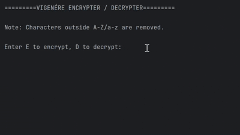

# Vigenere Encrypter / Decrypter

[](https://github.com/sunnivanordbjerga/vigenere/actions/workflows/ci.yml)
[](https://codecov.io/github/sunnivanordbjerga/vigenere)

[](https://opensource.org/licenses/MIT)

*A lightweight Vigenére encryption and decryption terminal program.*

<br>



<br>

---
## Features
- Symmetric cryptography
- Defensive input validation

---
## Project structure
```
├── src/                  # Source code
│   ├── main.py           # Terminal CLI application entrypoint
│   └── vigenere.py       # Core cryptographic algorithms
├── tests/                # Tests
│   └── test_vigenere.py
└── pyproject.toml        # Project metadata, tools (Ruff, Pytest), and dependencies
```

---

## Installation and running
### Clone
```bash
   git clone https://github.com/sunnivanordbjerga/vigenere
   cd vigenere
```
### Install dependencies
 ```bash
   pip install -e .[dev]
 ```
### Test
```bash
pytest
```

---

## Authors
Sunniva Nord Bjerga

---

## License
This project is licensed under an MIT license - see [LICENSE](LICENSE)
